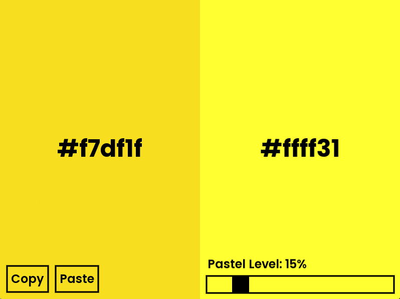
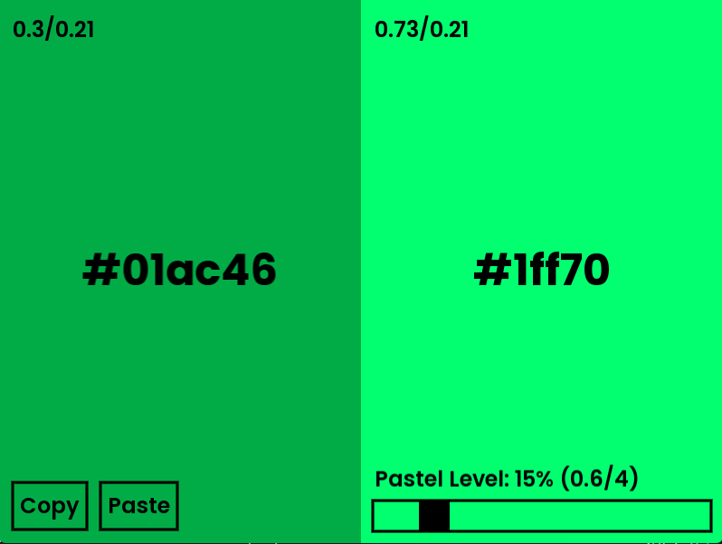

<h1 align="center">Welcome to Pastelizer 👋</h1>

## Debug mode
There is a hidden "menu" 👀, providing additional information, simply by holding the "D" key.

## Installation
For now, only Windows users can benefit from the compiled version. 😢

1. Browse through [releases](https://github.com/chmilhane/Pastelizer/releases), then select the version you want and then click on the 🗃️ `Pastelizer.zip` archive.

2. Once the archive is downloaded, you can extract it using [WinRAR](https://www.win-rar.com/start.html?&L=10), or simply by opening it with the file explorer.

3. Run `Pastelizer.exe`, and enjoy 😎

## Author
👤 **CHIHEB Milhane**
* Github: [@chmilhane](https://github.com/chmilhane)
* GitLab: [@chmilhane](https://gitlab.com/chmilhane)
* Discord: [darz.#5467](https://discord.com/users/709064224252624936)

## License
Distributed under the 📜 MIT License. See `LICENSE` for more information.

## Show your support
Give a ⭐️ if this project helped you!